# Imported Model

### State of Project.ImportedState

[comment]: # (
graph TD
A{Pending} --> B[LimitExceeded]
A --> C{Converting}
C --> D[Ready]
C --> E[Failed]
B --> |Re-upload| A
D --> |Re-upload| A
E --> |Re-upload| A
)

---

Last modified at {{ file.mtime }}
